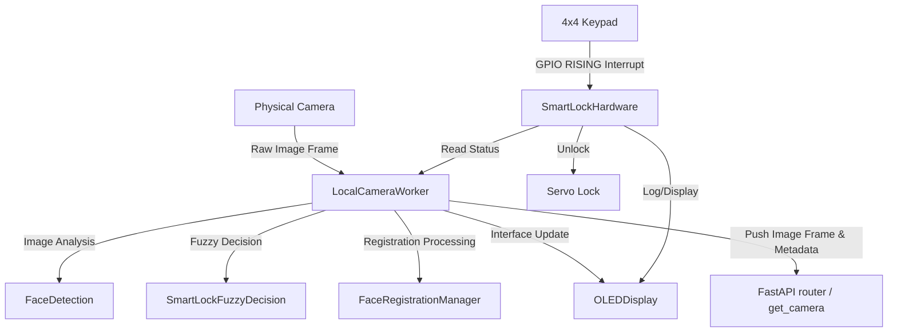

# Detailed Technical Documentation: Backend Services (SmartLock Fuzzy)

This document provides a detailed description of the architecture, algorithms, and operations of the services located in the [backend/services](/SmartLock_Fuzzy/backend/services) directory of the SmartLock Fuzzy smart lock system.

---

## 1. System Overview

The backend system of SmartLock Fuzzy is built on top of **FastAPI**, integrated with real-time image processing (**OpenCV**), a fuzzy decision system (**Fuzzy Logic Engine**), and hardware communication (**RPi.GPIO** & **luma.oled**).

Data and control flow diagram between the main service components:



---

## 2. Module Analysis

### 2.1 [local_camera.py](file:///d:/SmartLock_Fuzzy/backend/services/local_camera.py) (Central Coordinator)
This service manages the [LocalCameraWorker](file:///d:/SmartLock_Fuzzy/backend/services/local_camera.py#L35) class, running in a background thread to continuously capture frames from the camera and coordinate other services.

*   **Main Loop (`_run`)**:
    1.  Opens the camera device using OpenCV (`cv2.VideoCapture`). Supports configuration via environment variables such as `CAMERA_INDEX` (e.g., `/dev/video0`) and automatic image flipping (`CAMERA_FLIP`).
    2.  Captures raw frames at a predefined FPS (e.g., 10 FPS) to conserve Raspberry Pi CPU.
    3.  Sends the frame to [FaceDetection](file:///d:/SmartLock_Fuzzy/backend/services/face_detection.py#L15) for face detection and identity recognition.
    4.  If a face is detected:
        *   Sends facial feature information to [SmartLockFuzzyDecision](file:///d:/SmartLock_Fuzzy/backend/services/fuzzy_logic.py#L49) to evaluate the security risk level.
        *   If the fuzzy output is `"unlock"` and the user is not touching the keypad (to avoid conflict), the system automatically triggers door unlocking via [SmartLockHardware.unlock_door](file:///d:/SmartLock_Fuzzy/backend/services/hardware_io.py#L313) with the trigger source set to `"face"`.
    5.  If currently in user registration mode:
        *   Sends the frame to [FaceRegistrationManager](file:///d:/SmartLock_Fuzzy/backend/services/registration.py#L19) to save face templates, then updates the registration progress on the OLED.
    6.  Draws status overlays (lock state, fuzzy risk score, registration progress) onto the frame (`_draw_status`).
    7.  Encodes the resulting image into JPEG Base64 format and pushes it to the API cache via the `update_latest_camera_result` function.

---

### 2.2 [face_detection.py](file:///d:/SmartLock_Fuzzy/backend/services/face_detection.py) (Image Processing & Feature Measurement)
Provides the [FaceDetection](file:///d:/SmartLock_Fuzzy/backend/services/face_detection.py#L15) class, which is responsible for:

#### A. Face Detection
Uses OpenCV's default **Haar Cascade** classifier (`haarcascade_frontalface_default.xml`).
*   Color images are converted to grayscale to accelerate processing.
*   If multiple faces appear in the frame, the system automatically filters and retains only the face with the **largest bounding box area** (assumed to be the person closest to the camera).

#### B. Identity Recognition
Uses the **LBPH (Local Binary Patterns Histograms)** algorithm via the OpenCV Face module (`cv2.face.LBPHFaceRecognizer_create`).
*   The system loads the pre-trained model file at `custom_models/smartlock_lbph_model.xml` along with its associated JSON label map file (`.json`).
*   The detected face region is resized to a standard size of $100 \times 100$ pixels before being passed to the `predict` function.
*   If the LBPH distance is less than the `RECOGNITION_THRESH` threshold (defaulting to 80.0), the system assigns the corresponding identity name. Otherwise, it assigns the label `"Unknown"`.

#### C. Physical Metric Estimation
These are key inputs for the fuzzy decision system:
1.  **Illumination**:
    Calculated as the mean grayscale value of the face region of interest (ROI):
    $$\text{Illumination} = \frac{1}{N} \sum_{i,j \in \text{ROI}} I(i, j)$$
    Values range from $0$ (completely dark) to $255$ (overexposed/extremely bright).
2.  **Facial Angle**:
    Estimates the head yaw angle based on the illumination asymmetry between the left and right halves of the face:
    *   Splits the face width (ROI) in half.
    *   Calculates the mean brightness of the left half ($\mu_L$) and right half ($\mu_R$).
    *   Calculates asymmetry:
        $$\text{asymmetry} = \frac{|\mu_L - \mu_R|}{\mu_L + \mu_R}$$
    *   Normalizes the angle to a scale from $0^\circ$ (looking straight ahead) to $90^\circ$ (profile/side view):
        $$\text{Facial Angle} = \min(\text{asymmetry} \times 180.0, 90.0)$$

#### D. Registration Quality Verification (`extract_registration_face`)
When a user registers a new face, the system applies strict quality filters:
*   **Size**: Minimum width/height must reach 32 pixels (ensures the user is not standing too far away).
*   **Illumination**: Must fall within the safe range of $[35, 230]$ (avoids extreme darkness or glare).
*   **Facial Angle**: Must be less than $40^\circ$ (ensures the user is facing directly towards the camera).
*   **Blur Score**: Evaluated using the variance of the Laplacian operator (**Laplacian Variance**):
    $$\text{Blur Score} = \text{Variance}(\nabla^2 I_{roi})$$
    If this value is less than $20$, the frame is considered too blurry (out-of-focus or fast motion) and is discarded.
*   Valid face images are contrast-enhanced using **Histogram Equalization** via `cv2.equalizeHist` before being saved to disk.

---

### 2.3 [registration.py](file:///d:/SmartLock_Fuzzy/backend/services/registration.py) (Registration & Training Management)
Manages the live registration flow and model retraining through the [FaceRegistrationManager](file:///d:/SmartLock_Fuzzy/backend/services/registration.py#L19) class.

#### A. Duplicate-Prevention Sample Collection Mechanism
To train a robust model, the captured images need to cover diverse head angles (e.g., slight head tilting). The system controls this by:
*   Enforcing a minimum interval between samples (`min_sample_interval = 0.25` seconds).
*   Comparing the similarity between the current face frame and the last captured sample using the Mean Absolute Difference (MAD):
    $$\text{Similarity} = \frac{1}{N} \sum |I_{\text{current}} - I_{\text{last}}|$$
    If $\text{Similarity} < 1.5$, the system assumes the user has not moved and skips the frame, displaying the OLED message: *"Slightly change your head position"*.

#### B. Model Training
Once the requested number of samples is collected (default 30 samples, range 5 to 80):
1.  The system halts capture and transitions to the `"training"` state.
2.  Reads all subdirectories under `registered_faces/` (each directory represents a user identity).
3.  Only includes directories containing at least 3 sample images.
4.  Assigns an auto-incrementing integer ID to each identity, maps this ID to the display name (`display_name.txt`), and saves it as a JSON file.
5.  Initializes the LBPH trainer with optimal parameters:
    *   `radius = 1`, `neighbors = 8`: Radius and number of neighbors to compute binary patterns.
    *   `grid_x = 8`, `grid_y = 8`: Divides the image into an $8 \times 8$ grid to extract local histograms.
6.  Invokes the `train` method and saves the resulting model XML file, overwriting `custom_models/smartlock_lbph_model.xml`.
7.  After successful training, sends a signal to `LocalCameraWorker` to hot-reload the new model immediately without restarting the system.

---

### 2.4 [fuzzy_logic.py](file:///d:/SmartLock_Fuzzy/backend/services/fuzzy_logic.py) & [fuzzy_controller.py](file:///d:/SmartLock_Fuzzy/backend/infra/fuzzy_controller.py) (Fuzzy Decision Engine)
Uses the **Mamdani** fuzzy inference method via the `pyfuzzylite` library to make security actions based on 3 input variables.

```text
                +-------------------+
Confidence --->|                   |
Illumination ->|  Mamdani Engine   |---> Security Risk ---> Action & Details
Facial Angle ->|  (13 Fuzzy Rules) |
                +-------------------+
```

#### A. Input Fuzzy Sets (Antecedents)
Membership Functions for the input variables all use a Gaussian distribution of the form $\text{Gaussian}(\text{mean}, \text{stddev})$:
1.  **Model Confidence (C)** $[0, 85]$: Converted from LBPH distance ($100 - \text{distance}$) and capped at 85 (the practical maximum level).
    *   `LOW`: Gaussian $[0.0, 17.0]$
    *   `MEDIUM`: Gaussian $[42.5, 10.0]$
    *   `HIGH`: Gaussian $[85.0, 17.0]$
2.  **Illumination (I)** $[0, 255]$:
    *   `DARK`: Gaussian $[0.0, 40.0]$
    *   `NORMAL`: Gaussian $[128.0, 45.0]$
    *   `BRIGHT`: Gaussian $[255.0, 40.0]$
3.  **Facial Angle ($\theta$)** $[0, 90]$:
    *   `FRONTAL`: Gaussian $[0.0, 20.0]$
    *   `MARGINAL`: Gaussian $[90.0, 40.0]$

#### B. Output Fuzzy Set (Consequent)
*   **Security Risk** $[0.0, 1.0]$: (Defaults to $1.0$ - highest risk level - on error to ensure safety).
    *   `MINIMUM`: Gaussian $[0.0, 0.1]$
    *   `AVERAGE`: Gaussian $[0.5, 0.1]$
    *   `MAXIMUM`: Gaussian $[1.0, 0.08]$

#### C. Fuzzy Rule Base
Consists of 13 fuzzy logic rules linking the input variables to the output risk level:
1.  **R1**: `IF` model_confidence is LOW `THEN` security_risk is MAXIMUM (Low recognition confidence / stranger).
2.  **R2**: `IF` model_confidence is HIGH `AND` illumination is NORMAL `AND` facial_angle is FRONTAL `THEN` security_risk is MINIMUM (Direct unlock).
3.  **R3**: `IF` model_confidence is HIGH `AND` illumination is NORMAL `AND` facial_angle is MARGINAL `THEN` security_risk is AVERAGE (Requires OTP).
4.  **R4**: `IF` model_confidence is HIGH `AND` illumination is DARK `AND` facial_angle is FRONTAL `THEN` security_risk is AVERAGE.
5.  **R5**: `IF` model_confidence is HIGH `AND` illumination is DARK `AND` facial_angle is MARGINAL `THEN` security_risk is AVERAGE.
6.  **R6**: `IF` model_confidence is HIGH `AND` illumination is BRIGHT `AND` facial_angle is FRONTAL `THEN` security_risk is AVERAGE.
7.  **R7**: `IF` model_confidence is HIGH `AND` illumination is BRIGHT `AND` facial_angle is MARGINAL `THEN` security_risk is AVERAGE.
8.  **R8**: `IF` model_confidence is MEDIUM `AND` illumination is NORMAL `AND` facial_angle is FRONTAL `THEN` security_risk is AVERAGE.
9.  **R9**: `IF` model_confidence is MEDIUM `AND` illumination is NORMAL `AND` facial_angle is MARGINAL `THEN` security_risk is MAXIMUM.
10. **R10**: `IF` model_confidence is MEDIUM `AND` illumination is DARK `AND` facial_angle is FRONTAL `THEN` security_risk is MAXIMUM.
11. **R11**: `IF` model_confidence is MEDIUM `AND` illumination is DARK `AND` facial_angle is MARGINAL `THEN` security_risk is MAXIMUM.
12. **R12**: `IF` model_confidence is MEDIUM `AND` illumination is BRIGHT `AND` facial_angle is FRONTAL `THEN` security_risk is AVERAGE.
13. **R13**: `IF` model_confidence is MEDIUM `AND` illumination is BRIGHT `AND` facial_angle is MARGINAL `THEN` security_risk is AVERAGE.

#### D. Defuzzification & Action Mapping
*   Uses the **Centroid** defuzzification method with a resolution of 200 partition steps to output a crisp score in the range $[0.0, 1.0]$.
*   Based on this risk score, the system maps to a physical lock action:
    *   **$\text{Risk} < 0.30$** $\rightarrow$ `unlock`: Unlock the door.
    *   **$\text{Risk} < 0.60$** $\rightarrow$ `otp`: Prompt for OTP code (Two-factor authentication).
    *   **$\text{Risk} < 0.85$** $\rightarrow$ `deny`: Deny access and log event.
    *   **$\text{Risk} \ge 0.85$** $\rightarrow$ `lockout`: Immediately lock system and trigger alarm.

*Note*: If the `pyfuzzylite` library is not installed on the target Raspberry Pi system, the source code provides a static logical fallback wrapper (`Fallback Decision`) simulating similar rule thresholds to prevent application crashes.

---

### 2.5 [hardware_io.py](file:///d:/SmartLock_Fuzzy/backend/services/hardware_io.py) (Peripheral Device Interaction)
The [SmartLockHardware](file:///d:/SmartLock_Fuzzy/backend/services/hardware_io.py#L57) class manages two main physical devices: a 4x4 matrix keypad for PIN input and a Servo motor controlling the physical door lock latch.

#### A. Interrupt-Driven 4x4 Matrix Keypad Scanning
Instead of using a continuous scanning loop (polling) that consumes significant CPU, the system uses Raspberry Pi's **Hardware Interrupts**:
*   **Wiring**:
    *   4 Rows: GPIO 17, 27, 22, 5 (Configured as OUTPUT).
    *   4 Columns: GPIO 6, 13, 19, 26 (Configured as INPUT, with internal `PULL_DOWN` resistors enabled).
*   **Normal State**: The system pulls all 4 Rows `HIGH`. The Columns wait in a listening state configured to trigger a rising-edge interrupt (`GPIO.RISING`).
*   **When a Key is Pressed**:
    1.  The electrical connection between a Row (HIGH) and a Column is closed, producing a `RISING` edge signal on that Column's pin, triggering the `_col_interrupt` handler.
    2.  The system applies a software debounce filter, ignoring any interrupts occurring within `< 250` milliseconds of the last registered keypress.
    3.  To identify which key was pressed (the `_scan_key` method):
        *   Sets all Row pins `LOW`.
        *   Sequentially pulls each Row `HIGH`, waits 5ms, then checks the logic level of the Column pin that triggered the interrupt.
        *   The Row that drives the Column `HIGH` indicates the row-column intersection of the pressed key (mapped via `_KEYMAP`).
        *   Restores all Rows to `HIGH` to prepare for the next keypress.

#### B. PIN Authentication & System Lockout
*   The default PIN is `"123456"`. Passwords are encrypted using the **SHA-256** hash function and compared securely.
*   Pressing the `*` key clears the current PIN input buffer.
*   Pressing the `#` key or entering exactly 6 digits automatically submits the input (`_submit_password`).
*   If incorrect inputs exceed 5 consecutive attempts (`_MAX_FAILED`):
    *   Triggers keypad lockout for 30 seconds (`_LOCKOUT_SECONDS`).
    *   The OLED display shows a countdown timer. Any PIN input attempt during this period is ignored.

#### C. Door Latch Servo Control
The physical door lock is simulated using an RC Servo motor controlled by a pulse-width modulation (**PWM**) signal on BCM GPIO pin 18 (hardware PWM channel):
*   PWM frequency: $50\text{ Hz}$ ($20\text{ ms}$ period).
*   **Unlocked Angle**: Duty Cycle = $7.5\%$ ($1.5\text{ ms}$ pulse width).
*   **Locked Angle**: Duty Cycle = $2.5\%$ ($0.5\text{ ms}$ pulse width).
*   **Servo Anti-Jitter Algorithm**: After changing the duty cycle to rotate the servo to the target angle, the system sleeps for $0.5$ seconds for the motion to complete, and then calls `ChangeDutyCycle(0)` to **completely disable the PWM signal**. This is critical for analog servos to eliminate mechanical buzzing/jitter, prevent motor wear, and conserve power.
*   When an unlock command is received, the system runs the routine on a separate thread (`threading.Thread`) to avoid blocking the camera feed. The door automatically re-locks after a configurable `unlock_duration` (default 5.0 seconds).

---

### 2.6 [oled_display.py](file:///d:/SmartLock_Fuzzy/backend/services/oled_display.py) (Status Display)
Controls a $128 \times 64$ pixel SSD1306 OLED display using SPI communication (bus 0, device 0, DC pin 24, RST pin 25).

*   **Interface Rendering**: Uses the `Pillow` library to create a $128 \times 64$ monochrome image canvas, then renders text, lines, circles, or progress bars via the `ImageDraw` object.
*   **Synchronization**: Employs a `threading.Lock` to prevent concurrent write collisions (e.g., when the camera thread updates a recognized face name while the keypad thread updates PIN entry indicators), which could crash the SPI bus transfer.
*   The OLED display updates dynamically based on hardware and recognition events:
    *   `show_idle()`: Idle status screen.
    *   `show_enter_pin(digits_entered)`: Renders dots representing the numbers entered.
    *   `show_access_granted(source)`: Displays access confirmation (via PIN or Face).
    *   `show_access_denied(message)`: Displays access denied message.
    *   `show_door_open(seconds)`: Displays countdown for how long the door remains open.
    *   `show_lockout(seconds)`: Displays lockout countdown timer for incorrect PIN entry.
    *   `show_registration(name, accepted, required)`: Draws a progress bar indicating the percentage of face images collected during user registration.

---

## 3. Raspberry Pi Pinout Mapping (Wiring Matrix)

Below is the BCM GPIO pinout mapping configured in the hardware services code:

| Device Component | Pin Type | GPIO Pin (BCM) | Notes |
| :--- | :--- | :--- | :--- |
| **Keypad Row 1** | Output | **GPIO 17** | Row 1 of keypad matrix |
| **Keypad Row 2** | Output | **GPIO 27** | Row 2 of keypad matrix |
| **Keypad Row 3** | Output | **GPIO 22** | Row 3 of keypad matrix |
| **Keypad Row 4** | Output | **GPIO 5** | Row 4 of keypad matrix |
| **Keypad Col 1** | Input (Interrupt) | **GPIO 6** | Column 1, internal pull-down |
| **Keypad Col 2** | Input (Interrupt) | **GPIO 13** | Column 2, internal pull-down |
| **Keypad Col 3** | Input (Interrupt) | **GPIO 19** | Column 3, internal pull-down |
| **Keypad Col 4** | Input (Interrupt) | **GPIO 26** | Column 4, internal pull-down |
| **Servo Lock** | PWM Output | **GPIO 18** | Hardware PWM Channel 0 pin |
| **OLED MOSI (SDA)** | SPI Interface | **GPIO 10 (MOSI)** | SPI data line |
| **OLED SCLK (SCL)** | SPI Interface | **GPIO 11 (SCLK)** | SPI clock line |
| **OLED CS (Chip Select)** | SPI Interface | **GPIO 8 (CE0)** | SPI chip select 0 |
| **OLED DC (Data/Command)**| SPI Interface | **GPIO 24** | Data / Command distinction line |
| **OLED RST (Reset)** | SPI Interface | **GPIO 25** | Screen reset pin |
