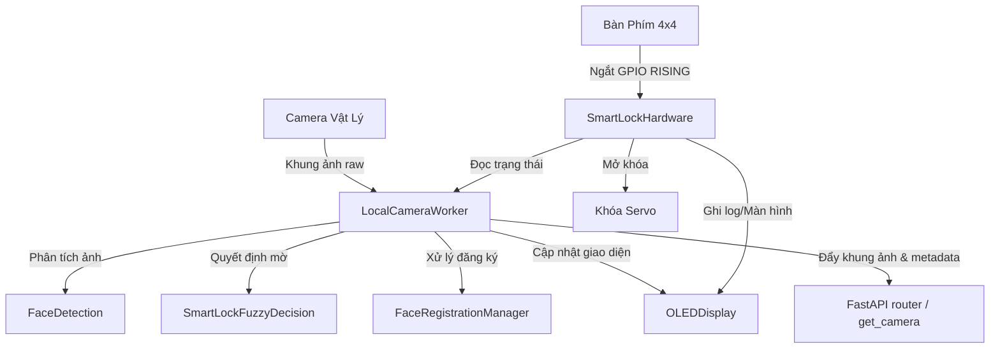

# Tài Liệu Kỹ Thuật Chi Tiết: Các Dịch Vụ Backend (SmartLock Fuzzy)

Tài liệu này mô tả chi tiết kiến trúc, thuật toán và cách thức hoạt động của các dịch vụ nằm trong thư mục [backend/services](file:///d:/SmartLock_Fuzzy/backend/services) thuộc hệ thống khóa thông minh SmartLock Fuzzy.

---

## 1. Tổng Quan Kiến Trúc Hệ Thống (System Overview)

Hệ thống backend của SmartLock Fuzzy được xây dựng trên nền tảng **FastAPI**, tích hợp xử lý ảnh thời gian thực (**OpenCV**), hệ thống quyết định mờ (**Fuzzy Logic Engine**) và giao tiếp phần cứng (**RPi.GPIO** & **luma.oled**).

Sơ đồ luồng dữ liệu và điều khiển giữa các thành phần dịch vụ chính:



---

## 2. Chi Tiết Từng Dịch Vụ (Module Analysis)

### 2.1 [local_camera.py](file:///d:/SmartLock_Fuzzy/backend/services/local_camera.py) (Bộ Điều Phối Trung Tâm)
Dịch vụ này quản lý lớp [LocalCameraWorker](file:///d:/SmartLock_Fuzzy/backend/services/local_camera.py#L35), chạy trong một tiến trình phụ (`Thread` ngầm) để liên tục bắt hình ảnh từ camera và điều phối các dịch vụ khác.

*   **Vòng lặp chính (`_run`)**:
    1.  Mở thiết bị camera qua OpenCV (`cv2.VideoCapture`). Hỗ trợ cấu hình qua môi trường như `CAMERA_INDEX` (ví dụ `/dev/video0`), tự động lật ảnh (`CAMERA_FLIP`).
    2.  Chụp ảnh raw ở một tần số FPS định sẵn (ví dụ 10 FPS) để tiết kiệm CPU cho Raspberry Pi.
    3.  Gửi khung ảnh sang dịch vụ [FaceDetection](file:///d:/SmartLock_Fuzzy/backend/services/face_detection.py#L15) để phát hiện khuôn mặt và nhận dạng danh tính.
    4.  Nếu phát hiện mặt:
        *   Gửi thông tin đặc trưng mặt sang [SmartLockFuzzyDecision](file:///d:/SmartLock_Fuzzy/backend/services/fuzzy_logic.py#L49) để đánh giá mức độ rủi ro an ninh.
        *   Nếu kết quả mờ là `"unlock"` và người dùng không chạm vào bàn phím (tránh xung đột), hệ thống tự động kích hoạt mở cửa qua [SmartLockHardware.unlock_door](file:///d:/SmartLock_Fuzzy/backend/services/hardware_io.py#L313) với nguồn kích hoạt là `"face"`.
    5.  Nếu đang trong chế độ đăng ký người dùng:
        *   Gửi khung ảnh sang [FaceRegistrationManager](file:///d:/SmartLock_Fuzzy/backend/services/registration.py#L19) để lưu mẫu khuôn mặt, sau đó hiển thị tiến trình trên OLED.
    6.  Vẽ đè các thông tin trạng thái (Trạng thái khóa, độ rủi ro mờ, tiến trình đăng ký) lên khung ảnh (`_draw_status`).
    7.  Mã hóa ảnh kết quả sang định dạng JPEG Base64 rồi đẩy vào bộ nhớ đệm của API qua hàm `update_latest_camera_result`.

---

### 2.2 [face_detection.py](file:///d:/SmartLock_Fuzzy/backend/services/face_detection.py) (Xử Lý Ảnh & Đo Lường)
Cung cấp lớp [FaceDetection](file:///d:/SmartLock_Fuzzy/backend/services/face_detection.py#L15) chịu trách nhiệm:

#### A. Phát Hiện Khuôn Mặt (Detection)
Sử dụng bộ phân loại thác **Haar Cascade** mặc định của OpenCV (`haarcascade_frontalface_default.xml`).
*   Ảnh màu được chuyển sang ảnh xám để tăng tốc xử lý.
*   Nếu có nhiều hơn một khuôn mặt xuất hiện trong khung hình, hệ thống sẽ tự động lọc và chỉ giữ lại khuôn mặt có **diện tích khung bao (Bounding Box) lớn nhất** (coi là người đứng gần camera nhất).

#### B. Nhận Dạng Danh Tính (Recognition)
Sử dụng thuật toán **LBPH (Local Binary Patterns Histograms)** qua OpenCV Face module (`cv2.face.LBPHFaceRecognizer_create`).
*   Hệ thống đọc file mô hình đã được huấn luyện sẵn tại `custom_models/smartlock_lbph_model.xml` kèm file nhãn ánh xạ dạng JSON (`.json`).
*   Vùng khuôn mặt phát hiện được resize về kích thước chuẩn $100 \times 100$ pixel trước khi đưa vào hàm `predict`.
*   Nếu khoảng cách (LBPH distance) nhỏ hơn ngưỡng `RECOGNITION_THRESH` (mặc định 80.0), hệ thống sẽ gán tên định danh tương ứng. Ngược lại, gán nhãn `"Unknown"`.

#### C. Ước Lượng Các Chỉ Số Vật Lý (Metadata Estimation)
Đây là các tham số quan trọng đầu vào cho hệ thống quyết định mờ:
1.  **Độ Chiếu Sáng (Illumination)**:
    Được tính bằng độ sáng trung bình (Mean Grayscale) của vùng chứa khuôn mặt (ROI):
    $$\text{Illumination} = \frac{1}{N} \sum_{i,j \in \text{ROI}} I(i, j)$$
    Giá trị nằm trong khoảng $0$ (tối hoàn toàn) đến $255$ (quá sáng).
2.  **Góc Nghiêng Mặt (Facial Angle)**:
    Ước lượng độ lệch hướng mặt (yaw) dựa trên sự bất đối xứng ánh sáng giữa nửa bên trái và nửa bên phải của khuôn mặt:
    *   Chia đôi chiều rộng khuôn mặt (ROI).
    *   Tính độ sáng trung bình nửa trái ($\mu_L$) và nửa phải ($\mu_R$).
    *   Tính độ bất đối xứng (asymmetry):
        $$\text{asymmetry} = \frac{|\mu_L - \mu_R|}{\mu_L + \mu_R}$$
    *   Góc nghiêng được chuẩn hóa về thang độ từ $0^\circ$ (nhìn thẳng) đến $90^\circ$ (nhìn nghiêng góc hoàn toàn):
        $$\text{Facial Angle} = \min(\text{asymmetry} \times 180.0, 90.0)$$

#### D. Kiểm Tra Chất Lượng Ảnh Đăng Ký (`extract_registration_face`)
Khi người dùng đăng ký khuôn mặt mới, hệ thống áp dụng các bộ lọc chất lượng nghiêm ngặt:
*   **Kích thước**: Chiều rộng/cao tối thiểu phải đạt 32 pixel (đảm bảo không đứng quá xa).
*   **Độ chiếu sáng**: Phải nằm trong khoảng an toàn $[35, 230]$ (tránh tối quá hoặc lóa sáng quá).
*   **Góc nghiêng mặt**: Phải nhỏ hơn $40^\circ$ (đảm bảo khuôn mặt hướng thẳng vào camera).
*   **Độ mờ (Blur Score)**: Sử dụng phương sai của bộ lọc Laplace (**Laplacian Variance**):
    $$\text{Blur Score} = \text{Variance}(\nabla^2 I_{roi})$$
    Nếu giá trị này nhỏ hơn $20$, khung ảnh bị coi là quá mờ (out-of-focus hoặc chuyển động nhanh) và bị loại bỏ.
*   Ảnh hợp lệ sẽ được chuẩn hóa lịch sử phân bố độ sáng (**Histogram Equalization**) bằng `cv2.equalizeHist` để tăng độ tương phản trước khi lưu xuống đĩa.

---

### 2.3 [registration.py](file:///d:/SmartLock_Fuzzy/backend/services/registration.py) (Quản Lý Đăng Ký & Huấn Luyện)
Quản lý luồng đăng ký trực tiếp và huấn luyện lại mô hình thông qua lớp [FaceRegistrationManager](file:///d:/SmartLock_Fuzzy/backend/services/registration.py#L19).

#### A. Cơ Chế Thu Thập Mẫu Tránh Trùng Lặp
Để huấn luyện mô hình tốt, ảnh chụp cần đa dạng góc nhìn (người dùng nghiêng đầu nhẹ). Hệ thống kiểm soát việc này bằng cách:
*   Áp dụng khoảng thời gian tối thiểu giữa các lần lấy mẫu (`min_sample_interval = 0.25` giây).
*   So sánh độ tương đồng giữa khuôn mặt ở khung hình hiện tại và ảnh lấy mẫu gần nhất trước đó bằng sai biệt tuyệt đối trung bình (Mean Absolute Difference):
    $$\text{Similarity} = \frac{1}{N} \sum |I_{\text{current}} - I_{\text{last}}|$$
    Nếu $\text{Similarity} < 1.5$, hệ thống coi như khuôn mặt chưa di chuyển và sẽ bỏ qua khung hình này kèm thông báo trên OLED: *"Slightly change your head position"* (Hãy dịch chuyển đầu nhẹ).

#### B. Huấn Luyện Mô Hình (Training)
Khi thu thập đủ số lượng mẫu yêu cầu (mặc định 30 mẫu, giới hạn từ 5 đến 80):
1.  Hệ thống dừng thu thập và chuyển sang trạng thái `"training"`.
2.  Đọc tất cả các thư mục con trong `registered_faces/` (mỗi thư mục đại diện cho một danh tính người dùng).
3.  Chỉ lấy các thư mục có ít nhất 3 mẫu ảnh.
4.  Cấp phát một ID số nguyên tự tăng cho mỗi danh tính, ánh xạ ID này với tên hiển thị (`display_name.txt`) và lưu thành file JSON.
5.  Khởi tạo bộ huấn luyện LBPH với các tham số tối ưu:
    *   `radius = 1`, `neighbors = 8`: Bán kính và số điểm lân cận tính mẫu nhị phân.
    *   `grid_x = 8`, `grid_y = 8`: Chia ảnh thành lưới $8 \times 8$ vùng để trích xuất histogram cục bộ.
6.  Gọi phương thức `train` và xuất file mô hình XML ghi đè vào `custom_models/smartlock_lbph_model.xml`.
7.  Sau khi huấn luyện thành công, gửi tín hiệu để `LocalCameraWorker` nạp lại mô hình mới ngay lập tức mà không cần khởi động lại hệ thống.

---

### 2.4 [fuzzy_logic.py](file:///d:/SmartLock_Fuzzy/backend/services/fuzzy_logic.py) & [fuzzy_controller.py](file:///d:/SmartLock_Fuzzy/backend/backend/infra/fuzzy_controller.py) (Hệ Quyết Định Mờ)
Sử dụng phương pháp suy luận mờ **Mamdani** thông qua thư viện `pyfuzzylite` để đưa ra các hành động an ninh dựa trên 3 biến đầu vào.

```text
               +-------------------+
Confidence --->|                   |
Illumination ->|  Mamdani Engine   |---> Security Risk ---> Action & Details
Facial Angle ->|  (5 Fuzzy Rules)  |
               +-------------------+
```

#### A. Định Nghĩa Tập Mờ Đầu Vào (Antecedents)
1.  **Model Confidence (C)** $[0, 100]$: Được chuyển đổi từ khoảng cách LBPH ($100 - \text{distance}$).
    *   `LOW`: Hình thang $[0.0, 0.0, 25.0, 45.0]$
    *   `MEDIUM`: Hình tam giác $[30.0, 50.0, 70.0]$
    *   `HIGH`: Hình thang $[55.0, 75.0, 100.0, 100.0]$
2.  **Illumination (I)** $[0, 255]$:
    *   `DARK`: Hình thang $[0.0, 0.0, 50.0, 90.0]$
    *   `NORMAL`: Hình tam giác $[60.0, 128.0, 195.0]$
    *   `BRIGHT`: Hình thang $[165.0, 210.0, 255.0, 255.0]$
3.  **Facial Angle ($\theta$)** $[0, 90]$:
    *   `FRONTAL`: Hình thang $[0.0, 0.0, 15.0, 35.0]$
    *   `MARGINAL`: Hình thang $[20.0, 40.0, 90.0, 90.0]$

#### B. Định Nghĩa Tập Mờ Đầu Ra (Consequent)
*   **Security Risk** $[0.0, 1.0]$: (Giá trị mặc định khi lỗi là $1.0$ - mức rủi ro cao nhất để đảm bảo an toàn).
    *   `MINIMUM`: Hình tam giác $[0.0, 0.0, 0.35]$
    *   `AVERAGE`: Hình tam giác $[0.25, 0.50, 0.75]$
    *   `MAXIMUM`: Hình thang $[0.65, 0.85, 1.0, 1.0]$

#### C. Tập Luật Mờ (Fuzzy Rules)
Gồm 5 luật logic mờ để liên kết các biến đầu vào với mức rủi ro đầu ra:
1.  **R1**: `IF` độ nhận diện HIGH `AND` ánh sáng NORMAL `AND` góc nghiêng FRONTAL `THEN` rủi ro là MINIMUM (Mở khóa an toàn).
2.  **R2**: `IF` độ nhận diện HIGH `AND` ánh sáng DARK `AND` góc nghiêng MARGINAL `THEN` rủi ro là AVERAGE.
3.  **R3**: `IF` độ nhận diện MEDIUM `AND` ánh sáng BRIGHT `AND` góc nghiêng MARGINAL `THEN` rủi ro là AVERAGE.
4.  **R4**: `IF` độ nhận diện MEDIUM `AND` ánh sáng DARK `AND` góc nghiêng FRONTAL `THEN` rủi ro là MAXIMUM.
5.  **R5**: `IF` độ nhận diện LOW `THEN` rủi ro là MAXIMUM (Nhận diện kém hoặc người lạ).

#### D. Giải Mờ (Defuzzification) & Ánh Xạ Hành Động
*   Sử dụng phương pháp trọng tâm **Centroid** với độ phân giải 200 bước chia để đưa ra điểm rủi ro rõ (crisp score) trong khoảng $[0.0, 1.0]$.
*   Từ điểm rủi ro, hệ thống ánh xạ ra hành động thực tế dựa trên ngưỡng:
    *   **$\text{Risk} < 0.30$** $\rightarrow$ `unlock`: Cho phép mở cửa.
    *   **$\text{Risk} < 0.60$** $\rightarrow$ `otp`: Yêu cầu nhập mã OTP (xác thực 2 lớp).
    *   **$\text{Risk} < 0.85$** $\rightarrow$ `deny`: Từ chối truy cập và ghi lại nhật ký.
    *   **$\text{Risk} \ge 0.85$** $\rightarrow$ `lockout`: Khóa hệ thống ngay lập tức & báo động.

*Lưu ý*: Nếu thư viện `pyfuzzylite` không được cài đặt trên hệ thống Raspberry Pi, mã nguồn cung cấp một lớp dự phòng (Fallback Decision) mô phỏng các ngưỡng logic tĩnh tương đương để tránh lỗi crash hệ thống.

---

### 2.5 [hardware_io.py](file:///d:/SmartLock_Fuzzy/backend/services/hardware_io.py) (Tương Tác Thiết Bị Ngoại Vi)
Lớp [SmartLockHardware](file:///d:/SmartLock_Fuzzy/backend/services/hardware_io.py#L57) quản lý hai thiết bị vật lý chính: Bàn phím ma trận 4x4 để nhập mã PIN và Servo điều khiển chốt khóa cửa.

#### A. Cơ Chế Quét Bàn Phím Ma Trận 4x4 Dựa Trên Ngắt (Interrupt-driven Keypad Matrix)
Thay vì sử dụng vòng lặp kiểm tra liên tục (polling) làm tiêu tốn CPU, hệ thống sử dụng cơ chế **Ngắt phần cứng** của Raspberry Pi:
*   **Wiring**:
    *   4 Hàng (Rows): GPIO 17, 27, 22, 5 (Cấu hình ngõ ra - OUTPUT).
    *   4 Cột (Cols): GPIO 6, 13, 19, 26 (Cấu hình ngõ vào - INPUT, có trở kéo xuống nội `PULL_DOWN`).
*   **Trạng thái bình thường**: Hệ thống kéo tất cả 4 Hàng lên mức cao (`GPIO.HIGH`). Các Cột ở trạng thái chờ và được kích hoạt ngắt cạnh lên (`GPIO.RISING`).
*   **Khi có phím nhấn**:
    1.  Mạch điện giữa Hàng (HIGH) và Cột được đóng, tạo ra một cạnh lên RISING tại chân Cột tương ứng. Ngắt kích hoạt hàm `_col_interrupt`.
    2.  Hệ thống áp dụng bộ lọc chống rung phần mềm (Debounce) bằng cách bỏ qua các ngắt xảy ra trong khoảng thời gian `< 250` mili giây.
    3.  Để xác định chính xác nút nào được nhấn (Hàm `_scan_key`):
        *   Hạ tất cả các Hàng xuống mức thấp (`GPIO.LOW`).
        *   Lần lượt kéo từng Hàng lên mức cao (`GPIO.HIGH`), chờ 5ms, rồi kiểm tra trạng thái logic của chân Cột bị kích hoạt ngắt.
        *   Hàng nào làm cho Cột lên mức cao thì giao lộ Hàng/Cột đó chính là phím được nhấn (dựa trên bản đồ phím `_KEYMAP`).
        *   Khôi phục lại tất cả các Hàng về mức cao (`GPIO.HIGH`) để sẵn sàng cho lần nhấn tiếp theo.

#### B. Cơ Chế Xác Thực PIN & Khóa Hệ Thống (Lockout)
*   Mã PIN mặc định là `"123456"`. Mật khẩu được mã hóa bằng hàm băm **SHA-256** và so sánh dưới dạng mã hash để bảo mật.
*   Bấm phím `*` để xóa bộ đệm PIN hiện tại.
*   Bấm phím `#` hoặc nhập đủ 6 ký tự số để tự động gửi xác thực (`_submit_password`).
*   Nếu nhập sai quá 5 lần liên tiếp (`_MAX_FAILED`):
    *   Kích hoạt trạng thái khóa bàn phím trong 30 giây (`_LOCKOUT_SECONDS`).
    *   OLED hiển thị bộ đếm ngược thời gian khóa. Mọi thao tác nhập PIN trong thời gian này đều bị từ chối.

#### C. Điều Khiển Động Cơ Servo Mở Cửa
Khóa cửa vật lý được giả lập bằng một động cơ RC Servo điều khiển bằng tín hiệu điều chế độ rộng xung (**PWM**) tại chân GPIO 18 (kênh phần cứng):
*   Tần số xung PWM: $50\text{ Hz}$ (chu kỳ $20\text{ ms}$).
*   **Góc mở khóa (Unlock)**: Duty Cycle = $7.5\%$ (độ rộng xung $1.5\text{ ms}$).
*   **Góc khóa (Lock)**: Duty Cycle = $2.5\%$ (độ rộng xung $0.5\text{ ms}$).
*   **Thuật toán chống rung Servo**: Sau khi thay đổi chu kỳ làm việc để xoay Servo đến góc mong muốn, hệ thống sẽ ngủ $0.5$ giây cho Servo chạy xong, sau đó gọi `ChangeDutyCycle(0)` để **tắt hoàn toàn xung điều khiển**. Điều này cực kỳ quan trọng đối với Servo analog để tránh hiện tượng rung giật cơ học, phát ra tiếng vo vo và tiết kiệm điện năng tiêu thụ.
*   Khi có lệnh mở khóa, hệ thống chạy một luồng độc lập (`threading.Thread`) để không chặn luồng camera chính. Khóa sẽ tự động khóa lại sau một khoảng thời gian `unlock_duration` (mặc định 5.0 giây).

---

### 2.6 [oled_display.py](file:///d:/SmartLock_Fuzzy/backend/services/oled_display.py) (Hiển Thị Trạng Thái)
Điều khiển màn hình OLED SSD1306 độ phân giải $128 \times 64$ điểm ảnh thông qua giao tiếp SPI (cổng 0, thiết bị 0, DC chân 24, RST chân 25).

*   **Vẽ giao diện**: Sử dụng thư viện `Pillow` để tạo một vùng đệm ảnh đen trắng kích thước $128 \times 64$, sau đó vẽ chữ, đường thẳng, hình tròn hoặc thanh tiến trình thông qua đối tượng `ImageDraw`.
*   **Đồng bộ**: Sử dụng `threading.Lock` để tránh trường hợp nhiều tiến trình (tiến trình camera cập nhật ảnh nhận dạng mặt, tiến trình bàn phím cập nhật dấu chấm PIN) ghi đè lên màn hình OLED cùng một lúc, gây ra lỗi truyền nhận bus SPI.
*   Màn hình OLED tự động cập nhật linh hoạt theo các sự kiện từ phần cứng và nhận diện khuôn mặt:
    *   `show_idle()`: Trạng thái chờ.
    *   `show_enter_pin(digits_entered)`: Hiển thị các chấm tròn đại diện cho mã PIN đang nhập.
    *   `show_access_granted(source)`: Hiển thị thông báo chấp nhận (qua PIN hay Khuôn mặt).
    *   `show_access_denied(message)`: Hiển thị từ chối truy cập.
    *   `show_door_open(seconds)`: Đồng hồ đếm ngược thời gian cửa đang mở.
    *   `show_lockout(seconds)`: Đếm ngược thời gian bị khóa do nhập sai PIN.
    *   `show_registration(name, accepted, required)`: Vẽ thanh tiến trình đồ họa hiển thị phần trăm ảnh khuôn mặt đã thu thập được khi đăng ký người dùng mới.

---

## 3. Bản Đồ Đấu Nối Raspberry Pi (Wiring Matrix)

Dưới đây là bảng cấu hình chân GPIO BCM thực tế được thiết lập trong mã nguồn của dịch vụ phần cứng:

| Thiết Bị | Loại Chân | Chân GPIO (BCM) | Ghi Chú |
| :--- | :--- | :--- | :--- |
| **Keypad Row 1** | Ngõ ra (Output) | **GPIO 17** | Hàng 1 của ma trận bàn phím |
| **Keypad Row 2** | Ngõ ra (Output) | **GPIO 27** | Hàng 2 của ma trận bàn phím |
| **Keypad Row 3** | Ngõ ra (Output) | **GPIO 22** | Hàng 3 của ma trận bàn phím |
| **Keypad Row 4** | Ngõ ra (Output) | **GPIO 5** | Hàng 4 của ma trận bàn phím |
| **Keypad Col 1** | Ngõ vào ngắt (Input) | **GPIO 6** | Cột 1, cấu hình Pull-Down nội |
| **Keypad Col 2** | Ngõ vào ngắt (Input) | **GPIO 13** | Cột 2, cấu hình Pull-Down nội |
| **Keypad Col 3** | Ngõ vào ngắt (Input) | **GPIO 19** | Cột 3, cấu hình Pull-Down nội |
| **Keypad Col 4** | Ngõ vào ngắt (Input) | **GPIO 26** | Cột 4, cấu hình Pull-Down nội |
| **Servo Lock** | Ngõ ra PWM | **GPIO 18** | Chân PWM phần cứng Channel 0 |
| **OLED MOSI (SDA)** | Giao tiếp SPI | **GPIO 10 (MOSI)** | Đường truyền dữ liệu SPI |
| **OLED SCLK (SCL)** | Giao tiếp SPI | **GPIO 11 (SCLK)** | Xung giữ nhịp SPI |
| **OLED CS (Chip Select)** | Giao tiếp SPI | **GPIO 8 (CE0)** | Chọn chip SPI 0 |
| **OLED DC (Data/Command)** | Giao tiếp SPI | **GPIO 24** | Chân phân biệt Dữ liệu/Lệnh |
| **OLED RST (Reset)** | Giao tiếp SPI | **GPIO 25** | Chân thiết lập lại màn hình |
