# SmartLock Fuzzy System Sequence Diagrams

This document outlines the four main operational workflows of the **SmartLock Fuzzy** system using Mermaid sequence diagrams. These diagrams model the real-time interaction between the hardware components (Raspberry Pi, OLED, Keypad, Servo), the FastAPI backend services, the computer vision pipeline, and the Next.js frontend dashboard.

---

## 1. System Startup & Lifespan Initialization

This workflow shows the lifecycle startup flow of the FastAPI application, background thread spawning, and the hardware peripheral configuration.

```mermaid
sequenceDiagram
    autonumber
    participant Main as backend/main.py (lifespan)
    participant CW as Camera Worker (local_camera.py)
    participant OLED as OLED Display (oled_display.py)
    participant HW as Hardware Controller (hardware_io.py)
    participant FD as Face Detector (face_detection.py)

    Main->>CW: camera_worker.start()
    activate CW
    
    %% OLED Init
    CW->>OLED: oled.start()
    activate OLED
    OLED-->>CW: Display initialized & show_idle()
    deactivate OLED

    %% Hardware Init
    CW->>HW: hardware.start()
    activate HW
    HW->>HW: GPIO.setmode(GPIO.BCM)
    HW->>HW: Setup Row/Col pin modes
    
    %% Servo Calibration
    HW->>HW: Start Servo PWM (lock duty cycle 2.5)
    Note over HW: Sleep 0.3s calibration
    HW->>HW: Set Servo Duty Cycle to 0 (anti-vibration)
    
    %% Keypad Interrupt attachment
    rect rgb(30, 41, 59)
        note over HW: Attach rising-edge interrupts to column pins
        HW->>HW: GPIO.add_event_detect(col_pins, GPIO.RISING)
    end
    HW-->>CW: GPIO initialized & interrupts active
    deactivate HW

    %% Thread Spawning
    CW->>CW: Spawn background thread (_run)
    activate CW
    Note over CW: Running in parallel loop
    
    %% Open Camera & Load models
    CW->>CW: _open_camera() via V4L2
    CW->>FD: Load Haar Cascade & LBPH model xml
    FD-->>CW: Models loaded
    deactivate CW
    deactivate CW
```

---

## 2. Live Face Recognition & Security Decision Loop

This diagram models the continuous inference loop: capturing camera frames, detecting faces, extracting features (confidence, illumination, angle), running the fuzzy logic engine to determine the security risk, and actuating the lock if safe.

```mermaid
sequenceDiagram
    autonumber
    actor User as User
    participant CW as Camera Worker (local_camera.py)
    participant FD as Face Detector (face_detection.py)
    participant FL as Fuzzy Decision (fuzzy_logic.py)
    participant FC as Fuzzy Controller (fuzzy_controller.py)
    participant OLED as OLED Display (oled_display.py)
    participant HW as Hardware Controller (hardware_io.py)
    participant FE as Next.js Dashboard (Frontend)

    rect rgb(33, 37, 41)
        note over CW: Camera Frame Processing Loop (e.g., 10 FPS)
        CW->>CW: Capture frame from camera
        CW->>FD: analyze(frame)
        activate FD
        FD->>FD: Convert to grayscale
        FD->>FD: Detect faces (Haar Cascade)
        FD->>FD: Extract ROI & Estimate illumination
        FD->>FD: Estimate facial angle (left-right ROI symmetry)
        FD->>FD: Predict identity & confidence (LBPH model)
        FD-->>CW: return detections metadata
        deactivate FD

        CW->>FL: evaluate_detection(detection)
        activate FL
        FL->>FL: Scale confidence: 100 - (70 * distance / threshold)
        FL->>FC: evaluate(confidence, illumination, angle)
        activate FC
        Note over FC: Fire 13 Mamdani Fuzzy Rules (Gaussian)
        FC->>FC: Defuzzify Security Risk (Centroid method)
        FC->>FC: Map Security Risk to action (unlock/otp/deny/lockout)
        FC-->>FL: return action & security_risk
        deactivate FC
        FL-->>CW: return action & security_risk
        deactivate FL

        alt Keypad Inactive AND Action == "unlock"
            CW->>OLED: show_access_granted("face")
            CW->>HW: Spawn thread: unlock_door("face")
            activate HW
            HW->>HW: Set Servo Duty Cycle to 7.5 (unlock)
            Note over HW: Sleep 0.5s, then set Duty to 0 (anti-vibration)
            HW->>OLED: show_door_open(unlock_duration)
            Note over HW: Wait 5 seconds
            HW->>HW: Set Servo Duty Cycle to 2.5 (lock)
            Note over HW: Sleep 0.5s, then set Duty to 0 (anti-vibration)
            HW->>OLED: show_idle()
            deactivate HW
        else Keypad Inactive AND Face Detected (Access Denied)
            CW->>OLED: show_face_detected(name, action, risk)
        end

        CW->>CW: update_latest_camera_result() [updates cache in memory]
    end

    %% Web Poll
    rect rgb(30, 27, 75)
        note over FE: Polling Frame Thread
        FE->>CW: GET /api/v1/camera/frame
        CW-->>FE: Return latest base64 JPEG + metadata
        FE->>FE: Render live feed, risk score, & history on UI
    end
```

---

## 3. Interrupt-Driven Keypad PIN Verification & Lockout

This diagram covers the interrupt lifecycle. When a key is pressed, it triggers a GPIO interrupt which initiates a matrix scan to identify the key. Once a 6-digit PIN is collected, it validates it using a secure SHA-256 hash comparison and handles lockout conditions.

```mermaid
sequenceDiagram
    autonumber
    actor User as User
    participant GPIO as RPi GPIO (Interrupt Controller)
    participant HW as Hardware Controller (hardware_io.py)
    participant OLED as OLED Display (oled_display.py)

    User->>GPIO: Presses key on 4x4 Keypad
    GPIO->>HW: ISR Callback: _col_interrupt(col_pin)
    activate HW
    
    %% Debounce check
    HW->>HW: Software debounce check (250ms threshold)
    
    %% Matrix scan
    rect rgb(6, 78, 59)
        note over HW: Row-by-Row Active Scanning
        HW->>HW: Pull all rows LOW
        loop For each row_pin in ROW_PINS
            HW->>HW: Pull row_pin HIGH
            HW->>HW: Read value of col_pin
            alt col_pin is HIGH
                HW->>HW: Resolve key from _KEYMAP[row][col]
                HW->>HW: Break loop
            end
            HW->>HW: Pull row_pin LOW
        end
        HW->>HW: Pull all rows back HIGH
    end

    alt Key == "*"
        HW->>HW: Clear key buffer
        HW->>OLED: show_idle()
    else Key is digit
        HW->>HW: Append key to buffer
        HW->>OLED: show_enter_pin(digits_entered, 6)
        
        alt Buffer reaches 6 digits (or user presses "#")
            HW->>HW: _submit_password()
            
            alt Lockout Active (current_time < lockout_until)
                HW->>OLED: show_lockout(remaining_seconds)
            else
                HW->>HW: Hash entered PIN using SHA-256
                
                alt Entered Hash == Saved Hash (Success)
                    HW->>HW: Reset failed attempts to 0
                    HW->>OLED: show_access_granted("keypad")
                    HW->>HW: Spawn thread: unlock_door("keypad")
                    Note over HW: Actuates Servo PWM, waits, re-locks (as in Diagram 2)
                else Entered Hash != Saved Hash (Failure)
                    HW->>HW: Increment failed attempts
                    alt Failed Attempts >= 5
                        HW->>HW: Set lockout_until = current_time + 30s
                        HW->>OLED: show_lockout(30)
                    else
                        HW->>OLED: show_access_denied(Wrong PIN)
                    end
                end
            end
        end
    end
    deactivate HW
```

---

## 4. Interactive Face Registration & Model Retraining

This diagram demonstrates the workflow when registering a new user: starting a session, validating quality metrics (illumination, blur, frontal angle) on consecutive camera frames, saving the crops, training the LBPH model, and hot-reloading it in the active recognition thread.

```mermaid
sequenceDiagram
    autonumber
    actor User as User
    participant FE as Next.js Dashboard (Frontend)
    participant BE as FastAPI Server (main.py)
    participant CW as Camera Worker (local_camera.py)
    participant REG as Registration Manager (registration.py)
    participant FD as Face Detector (face_detection.py)
    participant OLED as OLED Display (oled_display.py)

    User->>FE: Enter name, click "Register"
    FE->>BE: POST /api/v1/register/start {name, samples: 30}
    activate BE
    BE->>CW: start_registration(name, 30)
    activate CW
    CW->>REG: start(name, 30)
    activate REG
    REG->>REG: Create directory: registered_faces/slugified_name
    REG->>REG: Save raw display_name.txt
    REG->>REG: Initialize registration session state
    REG-->>CW: return session status
    deactivate REG
    CW-->>BE: return session status
    deactivate CW
    BE-->>FE: return started event
    deactivate BE

    %% Quality evaluation loop
    rect rgb(76, 5, 25)
        note over CW, REG: In Camera Worker loop, for every frame...
        CW->>REG: process_frame(frame, detector)
        activate REG
        REG->>FD: extract_registration_face(frame)
        activate FD
        FD->>FD: Detect face
        FD->>FD: Measure size, illumination, angle, blur_score
        
        alt Quality checks fail (too dark/bright/blurry/marginal)
            FD-->>REG: return accepted=False, reason
            REG-->>CW: return registration_progress status (waiting)
            CW->>OLED: show_registration(name, current, 30) [with warning message]
        else Quality checks pass
            FD-->>REG: return accepted=True, equalized_roi
            deactivate FD
            REG->>REG: Compare similarity to previous sample (diff >= 1.5)
            alt Similarity is too high (User is too static)
                REG-->>CW: return registration_progress (waiting for head shift)
            else Passed similarity
                REG->>REG: Save ROI as sample_timestamp.jpg to user directory
                REG->>REG: Increment accepted count
                REG-->>CW: return registration_progress (accepted)
                CW->>OLED: show_registration(name, accepted, 30)
            end
        end
        deactivate REG
    end

    %% Training step
    rect rgb(88, 28, 135)
        note over CW, REG: When accepted reaches 30
        REG-->>CW: return registration_training event
        CW->>REG: train_model()
        activate REG
        REG->>REG: Read JPEG files & resize to 100x100
        REG->>REG: Create cv2.face.LBPHFaceRecognizer
        REG->>REG: Train model & write smartlock_lbph_model.xml
        REG->>REG: Write model mapping JSON label file
        REG-->>CW: return registration_complete summary
        deactivate REG

        CW->>FD: reload_recognizer(recognizer_path)
        activate FD
        FD->>FD: Reload recognizer XML and label JSON
        deactivate FD

        CW->>OLED: show_message("Registered!", "Model Trained")
    end
    
    FE->>BE: GET /api/v1/register/status
    BE-->>FE: Return current session status (or idle if complete)
```

